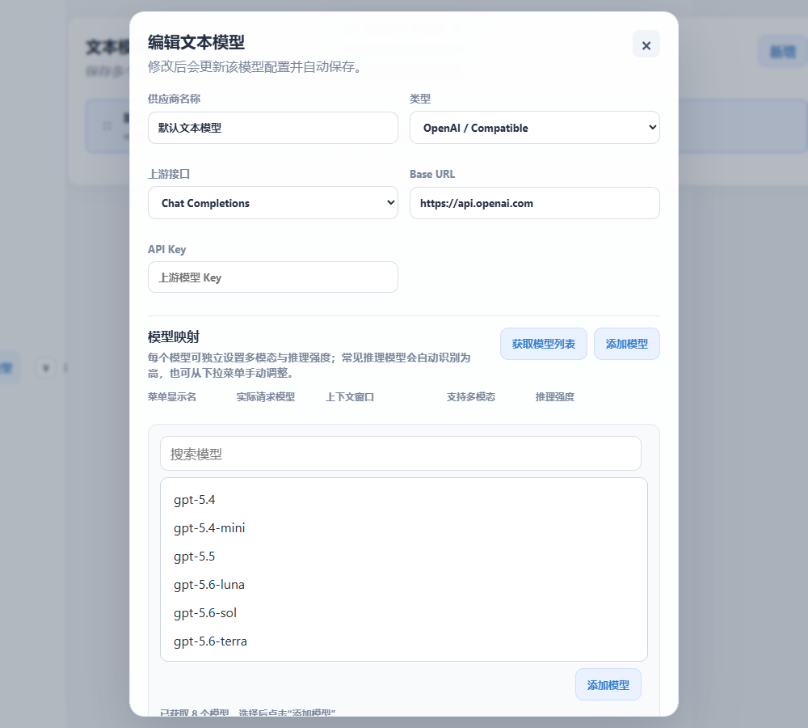

# Vision Relay

Vision Relay 是一个本地桌面客户端式的多接口 AI 模型中转工具。它把外部客户端发来的图片请求先交给视觉模型解析，再把解析结果转成纯文本上下文转发给文本模型，让只支持文本的上游模型也能间接处理图片。

项目使用 Go 编写后端和桌面外壳，前端静态资源通过 `embed` 打进二进制。Windows 下可以编译成单个 `vision-relay.exe`，启动后默认打开桌面窗口，并在系统托盘驻留。

## 功能特性

- 本地 HTTP 中转服务，默认监听 `http://127.0.0.1:8787`
- 桌面 WebView 窗口和系统托盘菜单
- 支持文本模型与视觉模型分开配置，并保存多套模型方案
- 支持 OpenAI Chat Completions、OpenAI Responses、Anthropic Messages、Gemini、Ollama 等常见接口形态
- 本地 API 默认无需访问令牌，可直接接入兼容客户端
- 支持为 Codex、OpenCode、Claude、OpenClaw 等客户端生成接入配置
- 支持一键配置 Codex、OpenCode、Claude、OpenClaw
- 支持切换 Codex 第三方模型时保留官方登录，并可统一官方与第三方会话历史
- 内置请求日志、Token 统计、首 token 耗时、缓存命中等记录
- 支持网络代理 URL，适配本地代理或 fake-ip 网络环境

## 界面预览



## 版本更新

### v1.7.1

- 文本模型配置中的“方案名称”调整为“供应商名称”，请求日志优先显示供应商名称，不再重复附加供应商类型。
- 文本与视觉模型方案列表的编辑、删除操作默认收起，在鼠标悬停或键盘聚焦时显示；触摸设备继续保持操作按钮可见。
- 模型配置弹窗新增视口高度限制和内部滚动，内容较多时不会超出屏幕。
- 优化模型选择面板布局，搜索框、模型列表和操作区改为全宽展示，提升模型较多时的可读性与操作体验。
- 新增模型选择界面预览，并补充供应商名称、方案操作和弹窗布局相关的前端资源测试。

### v1.7.0

- 客户端程序管理拆分桌面端与终端端，Codex、Codex CLI、Claude 和 Claude CLI 可分别检测路径、配置自动重启及未运行时自动启动。
- 一键配置 Codex 或 Claude 时会同时处理对应桌面客户端和 CLI，并在界面中分别反馈每个程序的重启、启动或警告状态。
- Claude 桌面端改用第三方配置库的 Gateway 配置格式，自动同步模型、认证方式并激活 Vision Relay 配置；Claude CLI 继续独立写入 `settings.json`。
- 自动迁移旧版 Claude CLI 配置路径和生命周期偏好，避免桌面端与 CLI 共用路径导致配置写错。
- 增强 Windows 客户端检测，支持 Codex CLI、Claude CLI 以及 Claude Desktop Squirrel 版本目录中的运行进程。
- 修正 Codex 保留官方登录时的本地隔离认证配置，避免官方令牌被错误发送到第三方供应商。
- 重构客户端路径与启动行为设置界面，采用桌面端/CLI 分行表格布局并优化窄屏显示。
- 补充客户端配置、路径迁移、进程识别、生命周期管理和前端资源测试。

### v1.6.0

- 本地 API 取消访问令牌验证，移除访问令牌管理页面和令牌生成接口，兼容客户端可直接连接。
- 一键配置不再写入本地 API 的真实访问令牌；Codex 开启“保留官方登录”时会写入仅发往本地 Vision Relay 的隔离标记，避免官方令牌被用于第三方请求。
- 关闭本地 API 后，已配置客户端可直连当前文本供应商，自动写入上游地址、真实令牌和已添加模型。
- 直连模式新增协议兼容性检查：Codex 支持 OpenAI Responses，Claude 支持 Anthropic，配置不兼容时会明确提示。
- 直连模式按模型同步多模态能力；中转模式同时识别文本模型原生图片能力和视觉模型中转能力。
- 新增浏览器跨域访问保护，在取消本地令牌后继续阻止非同源网页调用本地 API。
- 清理 OpenClaw 中已失效的 Vision Relay 模型引用，优化客户端配置、日志字段、响应文本解析和相关测试。
- 更新客户端接入界面、配置说明和测试覆盖。

### v1.5.0

- 新增程序设置页面，支持管理本地 API 监听地址、端口和转发接口启用状态。
- 新增客户端独立路由开关，切换模型供应商时仅同步已开启路由的客户端配置。
- 支持自定义并自动检测 Codex、OpenCode、Claude 和 OpenClaw 的配置文件及程序位置。
- 新增客户端自动重启和自动启动设置，一键配置由程序内置执行，不再弹出终端窗口。
- 增强 Windows 客户端进程识别、停止与启动逻辑，支持桌面程序、CLI 包装程序和进程树处理。
- Codex 桌面客户端支持动态检测 Microsoft Store 安装位置，不依赖固定版本号。
- 新增本地管理界面访问保护，限制管理页面和设置 API 从非本地来源访问。
- 优化客户端接入、程序设置和更新页面，并补充路径检测、路由、进程管理和前端资源测试。

### v1.4.0

- 新增 OpenClaw 一键配置，支持 JSON5 配置、环境变量路径、配置备份和模型能力同步。
- Codex、OpenCode、Claude、OpenClaw 改为分别创建或复用独立访问令牌。
- 模型映射新增推理强度设置，支持 `none`、`low`、`medium`、`high` 和 `xhigh`。
- 支持从旧版 `supports_reasoning` 配置迁移，并自动识别常见推理模型。
- 优化 Codex 模型目录、默认推理强度、客户端配置预览和请求日志归属。
- 补充 OpenClaw、推理能力、客户端令牌和前端资源测试。

### v1.3.0

- 全面升级桌面端界面，优化首页、Token 管理、模型配置和客户端接入页面。
- 引入 Vue 3 和 Element Plus 本地资源，新增统一确认弹窗与消息提示，运行时不依赖 CDN。
- 新增 Codex 官方登录保留开关，切换第三方模型时可保留官方 `auth.json`。
- 新增 Codex 统一会话历史，支持 JSONL 与 `state_5.sqlite` 迁移、备份和精确恢复。
- 文本模型的多模态能力改为按模型映射单独设置，同一供应商下可混合配置文本与多模态模型。
- 优化 Codex 托管认证的请求日志归属，并补充配置迁移、历史恢复和前端资源测试。

### v1.2.0

- 新增 Windows 桌面端自动更新，支持启动后自动检查和手动检查 GitHub Releases。
- 支持下载新版 `vision-relay.exe`、验证 SHA-256、安全替换并自动重启。
- 更新失败时自动恢复旧版本，降低桌面端自更新风险。
- 构建脚本支持嵌入版本号，并自动生成 `vision-relay.exe.sha256` 校验文件。
- 禁用桌面端静态资源缓存，避免更新后继续显示旧界面。

### v1.1.2

- 重构前端静态资源目录，改为 `frontend/public` 分层管理并继续由 Go embed 打包。
- 将 OpenAI Responses 与 Anthropic 协议转换逻辑拆分到 `backend/internal/protocol`，便于维护和测试。
- 优化 Codex 配置写入：支持 `CODEX_HOME`，默认不再把当前启动目录当作项目目录写入。
- 新增 `.gitignore` 忽略本地 `.codex/`、exe 备份文件，避免临时文件误提交。

### v1.1.1

- 新增 `tools/build-windows.ps1` 构建脚本，统一生成 Windows GUI 子系统的 `vision-relay.exe`。
- 修复双击启动时出现终端窗口的问题。
- README 编译和发布步骤改为使用一键构建脚本。

### v1.1.0

- 新增 Codex 一键配置入口，默认写入用户级配置；API 明确传入 `work_dir` 时才写入项目级配置。
- Codex 改用 `model_providers.custom` 和 `vision-relay-model.json` 专用模型目录，避免继续改写账号模型缓存。
- 支持把文本模型映射同步成 Codex 可见模型列表，并保留上下文窗口配置。
- 一键配置支持按客户端控制自动重启和自动启动，优先使用已检测到的桌面客户端或命令行程序位置。
- 增强旧版 Vision Relay、cc-switch 和重复 `[windows]` 配置的清理与接管逻辑。

## 工作原理

1. 外部客户端把请求发送到 Vision Relay 的本地地址。
2. Vision Relay 识别请求中的图片字段。
3. 如果当前文本模型不直接支持图片，则先调用配置好的视觉模型解析图片内容。
4. Vision Relay 删除原始图片字段，把“用户需求 + 图片解析结果”写回请求上下文。
5. 请求被转发给配置好的文本模型，上游响应会原样返回给客户端。

这样最终回答仍由文本模型完成，视觉模型只负责把图片转成可被文本模型理解的事实描述。

## 支持的接口

| 客户端协议 | 本地路径 | 说明 |
| --- | --- | --- |
| OpenAI Chat Completions | `/v1/chat/completions` 或 `/chat/completions` | 支持 `image_url`、`input_image` |
| OpenAI Responses / Codex | `/v1/responses` 或 `/responses` | 支持 `input_text`、`input_image` |
| Anthropic Messages | `/v1/messages` 或 `/messages` | 支持 `content[].type=image` |
| Gemini | `/v1beta/models/{model}:generateContent` | 支持 `inline_data`、`file_data` |
| Ollama Chat | `/api/chat` | 支持 `images` |
| Ollama Generate | `/api/generate` | 支持 `images` |
| 其他路径 | 原路径透传 | 例如 `/v1/models`、`/api/tags` |

## 运行环境

- Windows 10/11
- Go 1.25 或更新版本
- Node.js 20 或更新版本（仅用于同步前端组件库资源）
- Microsoft Edge WebView2 Runtime
- 可访问上游模型 API 的网络环境

> 大多数 Windows 10/11 系统已经内置 WebView2 Runtime。如果桌面窗口无法打开，请先安装 Microsoft Edge WebView2 Runtime。

## 源码运行

```powershell
go run ./backend/cmd/vision-relay
```

启动后默认访问：

```text
http://127.0.0.1:8787
```

常用启动参数：

```powershell
# 指定监听地址
.\vision-relay.exe -addr 127.0.0.1:8787

# 只运行后台中转服务，不打开桌面窗口
.\vision-relay.exe -no-window

# 不打开窗口，也不打开浏览器
.\vision-relay.exe -no-open

# 同时打开系统默认浏览器
.\vision-relay.exe -browser

# 指定配置文件和数据库路径
.\vision-relay.exe -config .\config.json -db .\vision-relay.db
```

## 编译 Windows 桌面客户端

首次构建或更新 Vue / Element Plus 依赖后，先同步本地前端资源：

```powershell
cd frontend
npm install
npm run build
cd ..
.\tools\build-windows.ps1
```

Vue 3 和 Element Plus 会复制到 `frontend/public/assets/vendor`，程序运行时不依赖 CDN。仅修改业务 HTML、CSS 或 JS 时，可直接执行 `.\tools\build-windows.ps1`。

说明：

- `-s -w` 用于减小二进制体积。
- `-H windowsgui` 会生成 Windows GUI 子系统程序，双击运行时不会弹出控制台窗口。
- 前端页面和图标资源会随 Go 编译一起打进 `vision-relay.exe`。

如果需要调试日志窗口，可以去掉 `-H windowsgui`：

```powershell
go build -ldflags="-s -w" -o vision-relay.exe ./backend/cmd/vision-relay
```

## 打包发布

本项目发布为单文件 Windows 可执行程序：

```powershell
.\tools\build-windows.ps1
```

生成的文件：

```text
vision-relay.exe
vision-relay.exe.sha256
```

发布到 GitHub Release 时建议使用版本标签：

```powershell
git tag v1.7.1
git push origin v1.7.1
```

Release 标题建议为：

```text
Vision Relay v1.7.1
```

附件上传：

```text
vision-relay.exe
vision-relay.exe.sha256
```

## 配置说明

首次启动后，在桌面窗口中配置文本模型和视觉模型即可使用本地 API。

常用环境变量：

```text
VISION_RELAY_ADDR=127.0.0.1:8787

TEXT_PROVIDER=openai|anthropic|gemini|ollama
TEXT_BASE_URL=https://api.openai.com
TEXT_API_KEY=sk-...
TEXT_MODEL_OVERRIDE=
TEXT_WIRE_API=chat_completions|responses

VISION_PROVIDER=openai|anthropic|gemini|ollama
VISION_BASE_URL=https://api.openai.com
VISION_API_KEY=sk-...
VISION_MODEL=gpt-4o-mini
VISION_ENABLED=true

PROXY_URL=http://127.0.0.1:7890

OPEN_WINDOW=true
OPEN_BROWSER=false
```

本地 API 不需要访问令牌，外部客户端可以直接调用所有兼容入口。普通客户端的一键配置不会写入 API Key 或 Bearer Token；如果第三方客户端的界面强制要求填写 API Key，这是该客户端自身的限制，Vision Relay 本地 API 不会校验该值。Codex 开启“切换第三方时保留官方登录”时是唯一例外：provider 配置会写入仅用于本地路由隔离的无害 Bearer 标记。该标记不是上游 API Key，也不会被本地 API 校验，其作用是防止 Codex 将官方 ChatGPT 登录令牌用于第三方模型请求。关闭本地 API 后，客户端改为直连当前文本供应商，并写入供应商 API 地址、上游令牌和真实模型名；模型列表仍只包含当前供应商配置中已经添加的模型，不会自动导入上游的全部模型。

“客户端接入”中的每个客户端都提供独立的**路由**开关。一键配置会自动开启对应路由；之后切换文本供应商时，Vision Relay 只重写已开启路由的客户端配置，并提示重启受影响的客户端。关闭路由的客户端不会被供应商切换修改；恢复 Codex 官方模式时会同时关闭 Codex 路由。

## 程序设置

左侧“设置”菜单可以管理 Vision Relay 的运行参数：

- 可修改本地 API 的监听地址和端口。保存后需重启 Vision Relay 才会按新地址重新绑定。
- 可独立关闭或开启本地 API 转发接口。关闭时 `/v1/*` 等客户端接口返回 `503`，但管理页面、设置 API 和 `/healthz` 仍可使用；该开关保存后立即生效。
- 关闭本地 API 后，一键配置和文本供应商切换会让已配置客户端直连当前文本供应商，并写入供应商 API 地址、上游令牌和已添加模型的真实模型名（不会自动导入上游全部模型）；视觉模型中转不可用，文本模型的图片能力按每个模型的“支持多模态”设置写入客户端。 直连时 Codex 仅支持使用 Responses 协议的 OpenAI 兼容供应商，Claude 仅支持 Anthropic 协议供应商；协议不兼容或当前供应商未添加模型时会停止写入并给出提示。
- 可查看和修改 Codex、Codex CLI、OpenCode、Claude、Claude CLI、OpenClaw 的配置文件位置与客户端程序位置；Codex 桌面端与 CLI 共用配置，Claude 桌面端与 CLI 使用独立配置。
- Codex 桌面客户端支持自动检测 Microsoft Store 的 `OpenAI.Codex_*\app\ChatGPT.exe` 安装位置，不依赖固定版本号。
- Claude Desktop 与 Claude CLI 的路径检测和程序生命周期管理彼此独立：桌面端可识别 `%LOCALAPPDATA%\AnthropicClaude\claude.exe` 及 Squirrel 版本目录中的进程，CLI 可识别 PATH 中的 `claude` 命令；二者不会互相误判。

首次运行时会自动检测一次客户端路径。从没有该检测字段的旧版本升级时，也会自动执行一次，之后不会反复覆盖手动填写的路径。如需刷新，可在设置页点击“重新检测客户端”。

客户端配置文件位置会实际用于“一键配置”、路由同步和 Codex 官方模式恢复。客户端程序位置用于检测运行状态，并按“设置 → 一键配置行为”中的开关自动重启或启动客户端；这些操作由程序内置完成，不会弹出终端窗口。一键配置 Codex 或 Claude 时会同时处理对应桌面端与 CLI，并分别返回执行结果。默认自动重启配置前已运行的客户端，配置前未运行的客户端保持关闭。

## 客户端接入示例

OpenAI 兼容客户端：

```text
Base URL: http://127.0.0.1:8787/v1
API Key:  留空（本地 API 无需认证）
Endpoint: /v1/chat/completions
```

Codex / Responses 客户端：

```text
Base URL: http://127.0.0.1:8787/v1
API Key:  留空（本地 API 无需认证）
Endpoint: /v1/responses
```

Codex 桌面客户端推荐在“客户端接入”页面点击“一键配置 Codex”。Vision Relay 默认只写入用户级配置：

```text
%CODEX_HOME%\config.toml
%CODEX_HOME%\vision-relay-model.json
```

如果没有设置 `CODEX_HOME`，则使用 `%USERPROFILE%\.codex`。只有调用客户端配置 API 时明确传入 `work_dir`，才会额外写入该项目的 `.codex\config.toml` 和 `.codex\vision-relay-model.json`，避免把 Vision Relay 自身的启动目录误当成项目目录。

配置会使用 `model_providers.custom`、Responses wire API 和本机 `/v1` 地址。一键配置完全由 Vision Relay 内置逻辑直接写入配置文件，不调用终端命令。默认情况下，配置前已运行的客户端会自动重启，未运行的客户端不会被启动；可在“设置 → 一键配置行为”中为 Codex、Codex CLI、OpenCode、Claude、Claude CLI、OpenClaw 分别调整。

“Codex 应用增强”提供两个独立开关：

- **切换第三方时保留官方登录**：默认开启。开启后会保留 `%CODEX_HOME%\auth.json` 中的官方 ChatGPT 认证，并让 Codex 继续识别和展示官方账号身份。本地 API 模式会在 provider 配置中写入仅发往本机 Vision Relay 的隔离 Bearer 标记，第三方模型请求不会使用官方登录令牌；关闭本地 API、让 Codex 直连供应商时，则写入真实供应商令牌。如果关闭该选项，本地 API 模式不会激活官方账号身份；直连模式下 Vision Relay 会先把官方认证备份到 `%CODEX_HOME%\vision-relay-auth.json`，再把真实供应商令牌写入托管认证，重新开启或恢复官方模式时会还原备份。
- **统一 Codex 会话历史**：默认关闭。开启时，如果当前正使用官方 `openai` 配置，会安全改为不带第三方 `base_url` 的 `custom` OpenAI provider；当前为第三方配置时不会被覆盖。关闭时只会还原带有 Vision Relay 专用标记的官方 provider，不会误改第三方配置。还可把 `sessions`、`archived_sessions` 中原 `openai` 会话和 `state_5.sqlite` 中原官方线程迁移为共享的 `custom` 标识，使官方与第三方会话显示在同一历史列表。“恢复官方模式”按钮在该开关开启时也会使用同一 `custom` OpenAI provider。

统一历史迁移前会把 JSONL 原文件、SQLite 快照和迁移 ID 账本保存到 `%CODEX_HOME%\vision-relay-history-backups\unified\<时间戳>`。关闭开关时可按账本精确恢复原官方会话；开启期间新建的第三方 `custom` 会话不会被误改回 `openai`。如果 `config.toml` 配置了 `sqlite_home`，或设置了 `CODEX_SQLITE_HOME`，也会查找对应目录下的 `state_5.sqlite`。

> 跨供应商继续旧会话时，对方后端可能无法解密会话中的 `encrypted_content` 推理内容，从而导致继续会话失败。迁移只统一历史归属，不保证加密推理内容能跨供应商复用。

同一页面也提供“一键配置 OpenCode”和“一键配置 Claude”：OpenCode 配置写入 `%USERPROFILE%\.config\opencode\opencode.json`，Claude 桌面配置写入 `%LOCALAPPDATA%\Claude-3p\configLibrary\<active-id>.json`；同时 Claude CLI 配置写入 `%USERPROFILE%\.claude\settings.json`。现有配置中的其他字段会保留。

[OpenClaw](https://github.com/openclaw/openclaw) 可在同一页面点击“一键配置 OpenClaw”，默认写入 `%USERPROFILE%\.openclaw\openclaw.json`。配置会新增 `vision-relay` 自定义供应商，通过 `openai-completions` 接入本机 `/v1` 接口，同步当前模型映射、上下文窗口和图片输入能力，并将默认模型切换为 `vision-relay/<模型名>`。现有的其他 OpenClaw 配置会保留，写入前会在同目录生成带时间戳的备份。

如果设置了 `OPENCLAW_CONFIG_PATH`、`OPENCLAW_STATE_DIR` 或 `OPENCLAW_HOME`，Vision Relay 会按 OpenClaw 的路径规则写入对应配置。OpenClaw 配置文件支持 JSON5；一键配置可读取带注释、单引号和尾随逗号的现有文件，写回时会标准化为 JSON。详见 [OpenClaw 配置文档](https://docs.openclaw.ai/gateway/configuration)。

Anthropic / Claude 客户端：

```text
Base URL: http://127.0.0.1:8787
API Key:  留空（本地 API 无需认证）
Endpoint: /v1/messages
```

Gemini 客户端：

```text
Base URL: http://127.0.0.1:8787
API Key:  留空（本地 API 无需认证）
Endpoint: /v1beta/models/{model}:generateContent
```

Ollama 客户端：

```text
Base URL: http://127.0.0.1:8787
Endpoint: /api/chat 或 /api/generate
```

Ollama 客户端可直接调用本地接口，不需要附加 `Authorization`、`X-API-Key` 或 query `key`。

## 项目结构

```text
backend/cmd/vision-relay/              程序入口和 Windows exe 资源
backend/internal/protocol/             OpenAI Responses 与 Anthropic 协议转换
backend/internal/server/               HTTP 服务、中转、配置、日志、托盘和 WebView
backend/internal/server/assets/        桌面程序图标资源
frontend/assets.go                     前端静态资源嵌入入口
frontend/public/index.html             桌面客户端页面结构
frontend/public/assets/css/            页面样式
frontend/public/assets/js/             页面交互逻辑
frontend/public/assets/images/         页面图标资源
tools/                                 构建和辅助工具
go.mod                                 Go 模块依赖
```

## 常见问题

### 启动后窗口关闭，服务是否还在？

默认桌面模式下，关闭窗口不会退出服务。Vision Relay 会留在系统托盘中，可以从托盘菜单重新打开窗口或退出程序。

### 上游连接出现 `198.18.x.x`、超时或 fake-ip 问题怎么办？

在页面里的网络代理 URL 填写本地代理地址，例如：

```text
http://127.0.0.1:7890
```

### 文本模型本身支持图片怎么办？

在文本模型配置的“模型映射”列表中，为具体模型勾选“支持多模态”。勾选后图片会直接发送给该模型；同一供应商下未勾选的模型仍会在视觉能力开启时先调用视觉模型解析。

## License

请在发布前根据项目实际授权方式补充 License。

## 自动更新

Windows 桌面版会在启动后访问 GitHub Releases 自动检查新版本，也可以在左侧“更新”页面手动检查。发现新版本后，点击“下载更新并重启”，程序会：

1. 从 `xshentx/vision-relay` 的最新 GitHub Release 下载 `vision-relay.exe`；
2. 如果 Release 同时包含 `vision-relay.exe.sha256`，自动验证 SHA-256；
3. 备份当前程序为 `vision-relay.exe.old`，替换程序并自动重启；
4. 替换或重启失败时自动恢复旧版本。

发布构建时请传入与 Git tag 相同的版本号：

```powershell
.\tools\build-windows.ps1 -Version v1.7.1
```

构建脚本会生成 `vision-relay.exe` 和 `vision-relay.exe.sha256`，发布 Release 时应同时上传这两个文件。自动更新仅支持经构建脚本生成的 Windows EXE；`go run` 开发模式只检查更新，不自动替换。
